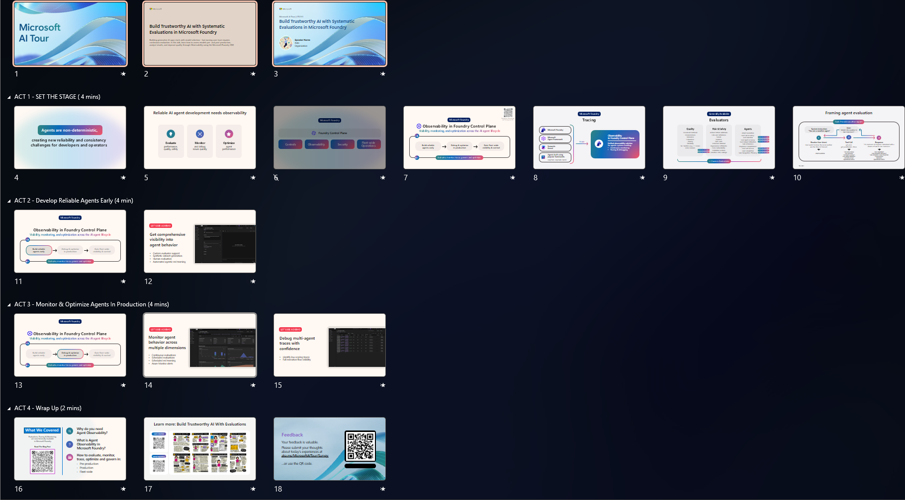

# Delivering this theater session

This repository contains the materials for a 15-minute theater session on building trustworthy AI with systematic evaluations. The time is just enough to set the stage with an explanation - then do two quick demos. This document provides the guidance you need, to deliver this session.

---

## 1. File Summary 🗂️

The links below provide access to the presentation, speaker notes, demo setup instructions - and a walkthrough video with speaker guidance. We recommend setting up the demo **at least 30 minutes ahead of the presentation time** so you can optimize the time to talk through the code & evaluation results.

| Resources          | Links                            | Description |
|-------------------|----------------------------------|-------------------|
| Session Delivery Deck     |  [PPT](https://aka.ms/AAxs6f7) | Powerpoint presentation |
| Speaker Prep | [Notes](#2-speaker-prep-️) | Suggested flow for talk  |
| Demo Prep | [Notes](#3-demo-prep-) |  Setup guidance for demo |
| Walkthrough| Video | Recorded walkthrough of talk |
|||

 

##  2. Speaker Prep 🎙️

The screenshot shows the outline for the talk, organized into timed sections. Create the demos the day before so you can jump straight into talking about the features and showing off the outcomes in the demo segments. **This talk has been refreshed to use the NEW Foundry portal and SDK features**.

| Row | Time | Notes |
|:---|:---|:---|
| 1 | 1 min | Introduce yourself · Introduce topic & scenario |
| 2 | 4 min | Introduce Foundry Control Plane · Describe Observability Features & Flow |
| 3 | 4 min | Demo Run 1: Agent Playground · Evaluations & Tracing in Portal |
| 4 | 4 min | Demo Run 2: Foundry SDK · Batch Evaluations · Tracing & Monitoring in Portal |
| 5 | 2 min | Wrap-up: Reinforce learnings · CTA is Repo with Resources & Next Steps |
| | |

 **Takeaway Message**: 

1. Reliable AI Agent Development Needs End-to-End Observability - with evaluations, tracing & monitoring.
1. Microsoft Foundry Control Plane provides a unified space to build agents - with clarity, consistency, and trust baked in.

 

## 3. Demo Prep 🚀

The repository is instrumented with GitHub Codespaces for convenience. Visit the [../labs/README.md](../labs/README.md) page for demo setup and walkthrough instructions.

 

## Thank you! 🏆

You just completed your AI Tour Presentation! 🎊

Thank you so much for your hard work! If you have comments or feedback, please reach out to the Content Owners and help us improve the experience for future tour attendees!